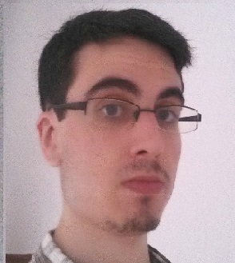

## Welcome to my GitHub page!

Greetings! My name is **Rafael Suárez Franco**. I'm a computer system management student and 3D origami artist, born in 1997. My skills are not very specific, as I am a person who's able to perform very different types of tasks, thanks to my quick learning capacity. That makes me a very 
**polyvalent** person, so I can focus in what I really like and also adapt to new experiences with almost no difficulty.

## Academic achievements
- Technology bachelor (9'11 average mark)
- Lifeguard and acuatic instructor grade
- C Aptis english level

You can check out my [CV](https://github.com/RafaelSuarezFranco/RafaelSuarezFranco.github.io/blob/master/curr%C3%ADculum.pdf) for an extended overview

## About 3D origami
3D origami is a very rare kind of art in which triangular paper pieces are used to create sculptures. Almost everything I know about 3D origami is self-taught. I have no official titulation about this, but I have a lot of experience and a long history of origami sculptures and paintings, which you can see in my [twitter](https://twitter.com/search?q=%40127origamisenp&src=typd&lang=es) or [instagram](https://www.instagram.com/127_origami_senpai/?hl=es)

## Contact
You can e-mail me to **cientoveintisiete127@gmail.com** or contact me via [linkedin](https://www.linkedin.com/in/rafael-su%C3%A1rez-franco-27136b174/)
